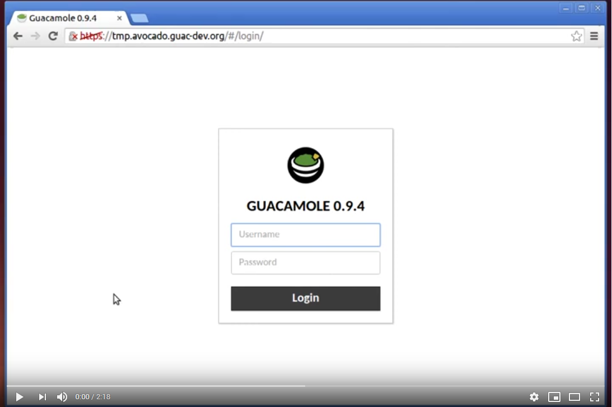

# K8S Guacamole


Apache Guacamole is a clientless HTML5 web based remote desktop gateway that makes it easy to access remote servers and desktops through a web browser. It supports standard protocols like VNC, RDP, and SSH.

In this repository, we are going to learn how to setup Guacamole web-based remote desktop access tool on Kubernetes server.

Kubernetes is fast developing and this deployment will target `kubernetes 1.16.x`.

You can see below a simple demo of Guacamole :

[](https://youtu.be/AjuHJHtd4zU)

## Image Usage

Images are fetched from Docker's image repo:

Guacamole: 1.1.0

* https://hub.docker.com/u/guacamole - Base

* https://hub.docker.com/r/guacamole/guacamole  - guacamole/guacamole:1.1.0
* https://hub.docker.com/r/guacamole/guacd  - guacamole/guacd:1.1.0

MariaDB (MySQL Clone): 10.5.3

* https://hub.docker.com/_/mariadb/ - mariadb:10.5.3

## Install on D2iQ Konvoy

https://d2iq.com/solutions/ksphere/konvoy#request-free-trial

`konvoy up -y`

## (Deprecated) Install required dependencies via orginal fork.

The Original Fork used Thomas Illiets setup. 

This Guacamole configuration uses 

[cert-manager](https://github.com/thomas-illiet/k8s-infrastructure/tree/master/config/cert-manager)
[ingress-nginx](https://github.com/thomas-illiet/k8s-infrastructure/tree/master/config/ingress-nginx)

configuration of these are stored in my 

[kubernetes infrastructure](https://github.com/thomas-illiet/k8s-infrastructure/) repository.

## Initializing the MySQL database

If your database is not already initialized with the Guacamole schema, you will need to do so prior to using Guacamole. A convenience script for generating the necessary SQL to do this is included in the Guacamole image.

run this command in your kubernetes worker to generate a SQL script :

kubectl exec -it guacamole-db-d9f4787d5-r4mm9 --namespace guacamole -- /bin/bash

The initcontainer on `guacamole-app`:

```bash
$> kubectl exec -it guacamole-app-7bbffc9b4c-fs5fv --namespace guacamole -c guacamole-init -- /bin/sh
init-container $> 
```

```bash
docker exec -i <APP CONTAINER ID> /opt/guacamole/bin/initdb.sh --mysql > /tmp/initdb.sql
```

And import `initdb.sql` to mariadb docker intance with the following command :

```bash
docker exec -i <DB CONTAINER ID> mysql -uguacamole -p<DB PASSWORD> guacamole < /tmp/test.sql
```

## Add Oauth2 to better protect your Guacamole instance

If you want to add a second authentication to better protect your Guacamole instance, you must first add the Oauth2 configuration files available in the following github repository [k8s-oauth2-proxy](https://github.com/thomas-illiet/k8s-oauth2-proxy).

Add the following annotations in your ingress configuration to redirect unauthenticated users to your oauth2 proxy.

```bash
nginx.ingress.kubernetes.io/auth-url: "https://$host/oauth2/auth"
nginx.ingress.kubernetes.io/auth-signin: "https://$host/oauth2/start"
```

To complete oauth2 configuration, add the following code to your input configuration.

```bash
---
apiVersion: extensions/v1beta1
kind: Ingress
metadata:
  name: guacamole-oauth2
  namespace: guacamole
spec:
  tls:
  - hosts:
    - sc6rffd3d5.netboot.fr
    secretName: guacamole-netboot-fr-tls
  rules:
  - host: sc6rffd3d5.netboot.fr
    http:
      paths:
      - path: /oauth2
        backend:
          serviceName: guacamole-oauth2
          servicePort: guacamole-oauth2
```
